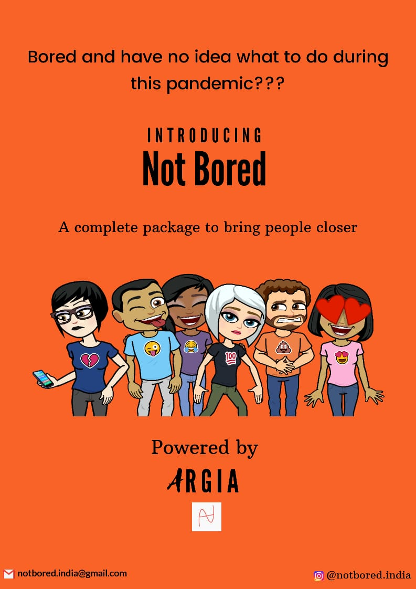

### Hi there 
# My name is Adithya A S
I am a senior in PES university, India with major in Computer Science
 

I created Not Bored for people looking for a variety of ways to connect with their friends.
This app not only provides a chat room for texting, but allows you to generate meet up requests which are anonymous, helping you connect with your friends in a much simpler and fascinating way.
<a href="https://play.google.com/store/apps/details?id=com.argia.not_bored" title="Not Bored">Not Bored</a>
  
 
 

**Reach me through :**

  

**I can work with**
 

If you want to check out more information 

<!--
**adithya-1/adithya-1** is a ✨ _special_ ✨ repository because its `README.md` (this file) appears on your GitHub profile.

Here are some ideas to get you started:

- 🔭 I’m currently working on ...
- 🌱 I’m currently learning ...
- 👯 I’m looking to collaborate on ...
- 🤔 I’m looking for help with ...
- 💬 Ask me about ...
- 📫 How to reach me: ...
- 😄 Pronouns: ...
- ⚡ Fun fact: ...
-->
